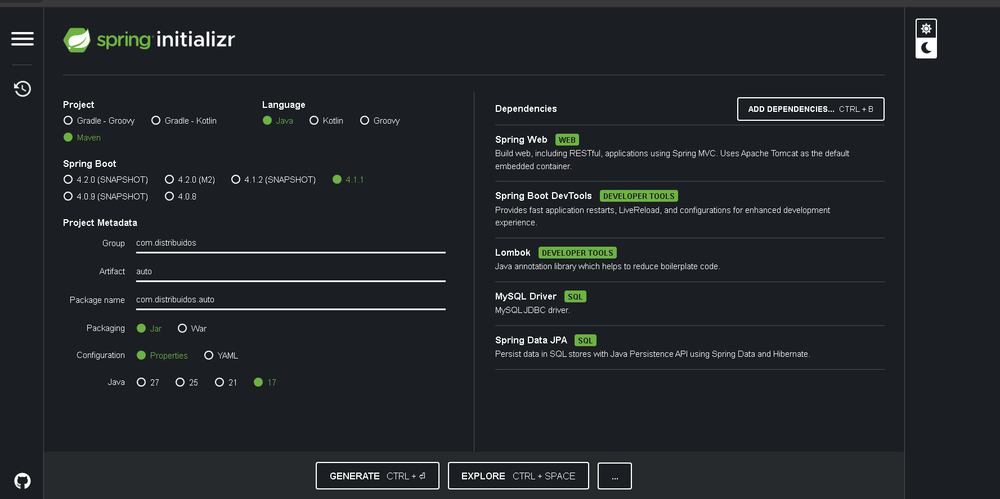
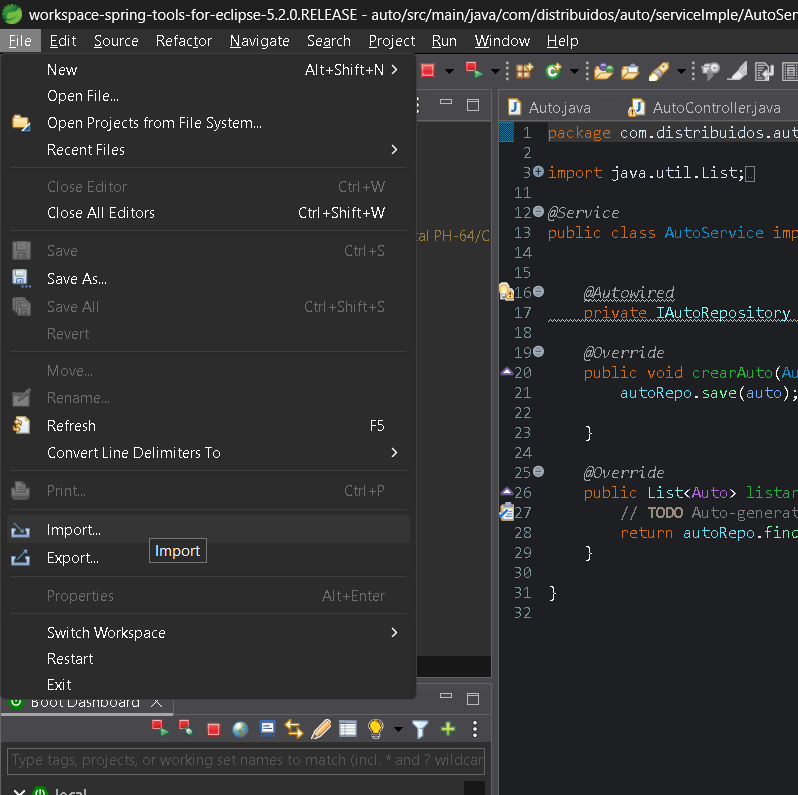
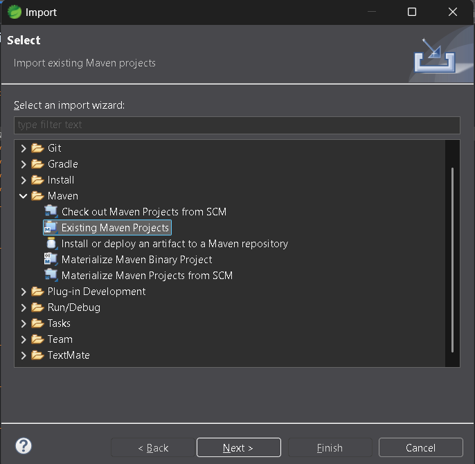
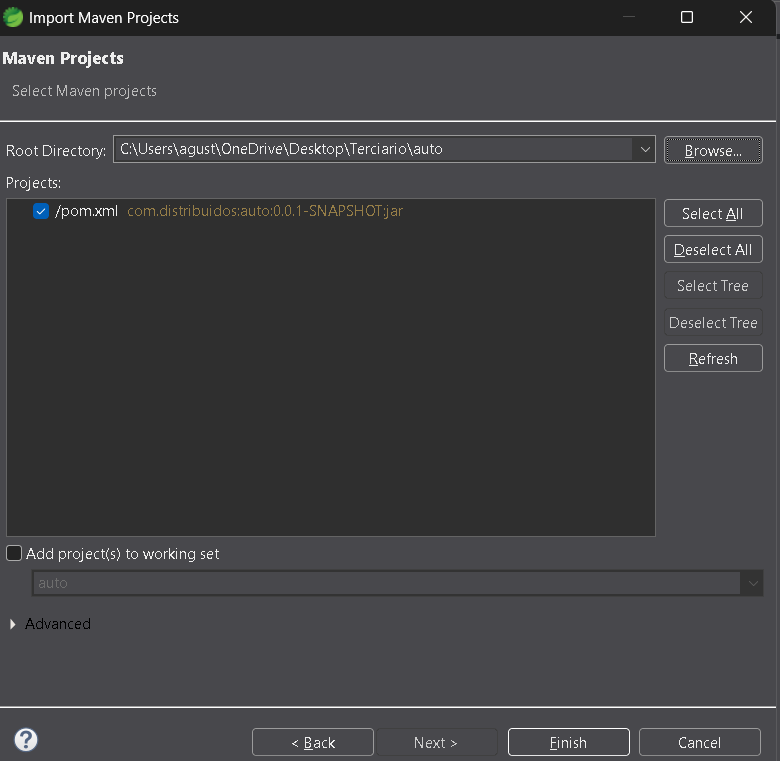
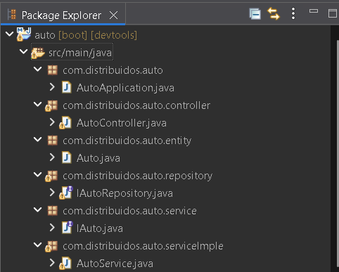
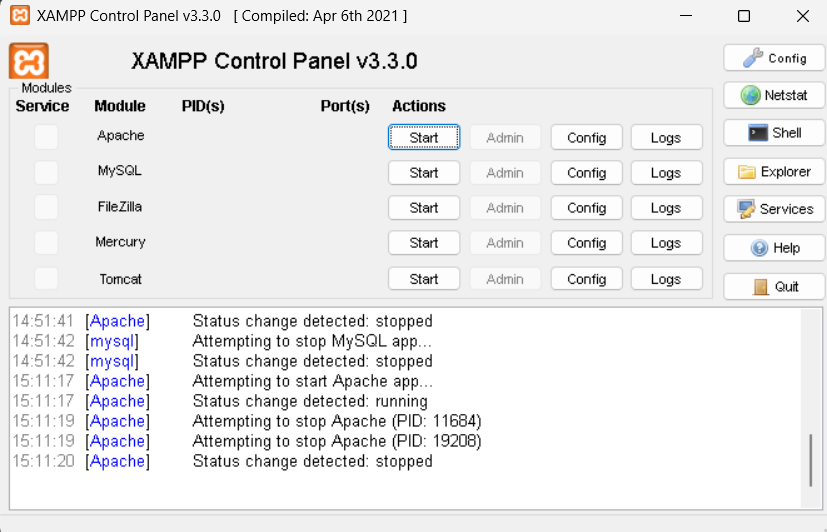
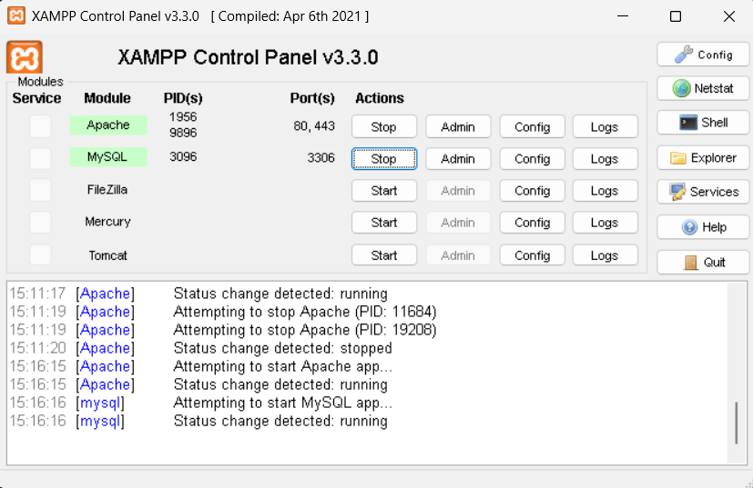
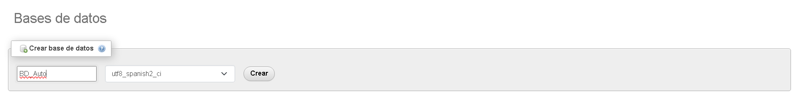
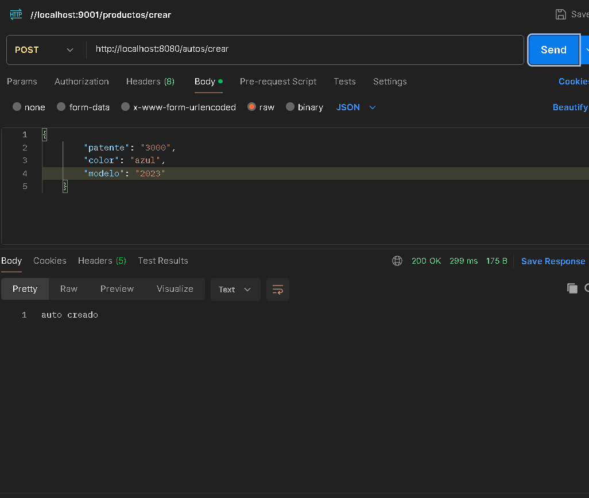
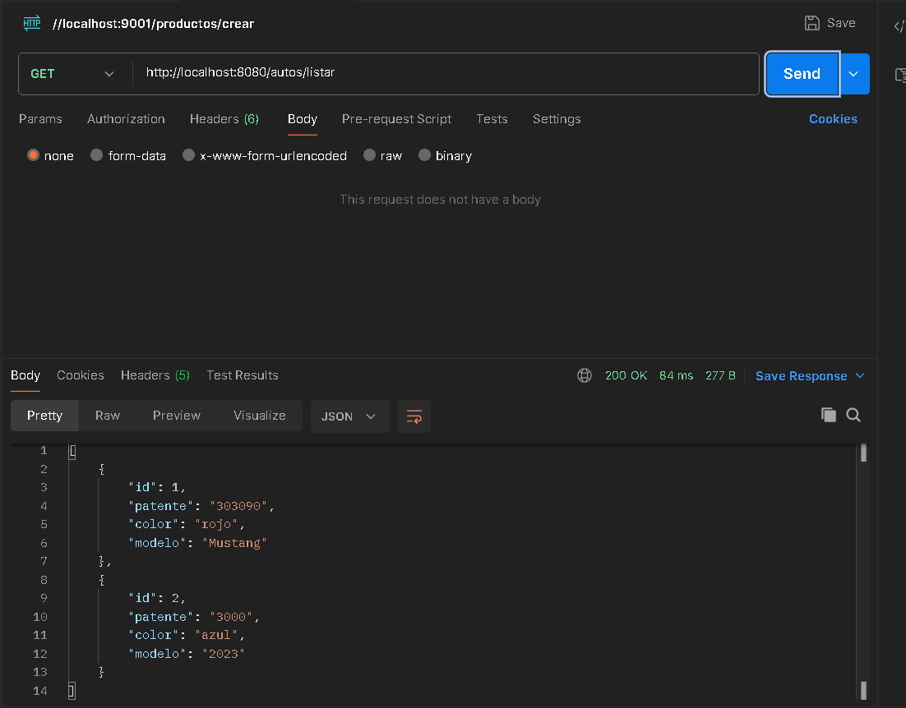

# Trabajo Practico Auto - Gutierrez Agustín Gabriel

## 1. Configuración del proyecto en Spring Initializr.


## 2. Importación en IDE.

### Paso 1: Seleccionar file → Import


### Paso 2: Expandir carpeta Maven → Existing Maveng Projects → Next


### Paso 3: Seleccionar Browse → Buscar el proyecto descargado → seleccionar Finish


## 3. Creación de la Estructura de Paquetes.

### Con la finalidad de respetar estrictamente la arquitectura en capas (Controller → Service → Repository → DB), es necesario crear 5 paquetes dentro de la ruta principal com.distribuidos.auto:

### Haga clic derecho sobre el paquete base com.distribuidos.auto.
### Diríjase a New > Package.
### Incorpore cada uno de los siguientes paquetes:

+ ###  com.distribuidos.auto.controller
+ ### com.distribuidos.auto.model
+ ### com.distribuidos.auto.repository
+ ### com.distribuidos.auto.service
+ ### com.distribuidos.auto.service

### La jerarquía dentro del proyecto deberá visualizarse de la siguiente manera:



## 4. Creación de la Entidad Auto.java.

### Las entidades basicamente serían nuestra tabla en la base de datos, dentro de la clase java se la indica con la anotación @Entity

### Seleccione New > Class e ingrese el nombre Auto.

```java
package com.distribuidos.auto.entity;

import jakarta.persistence.Entity;
import jakarta.persistence.GeneratedValue;
import jakarta.persistence.GenerationType;
import jakarta.persistence.Id;
import lombok.Getter;
import lombok.Setter;

@Getter @Setter
@Entity
public class Auto {
	
	@Id
	@GeneratedValue (strategy = GenerationType.IDENTITY)
	private Long id;
	private String patente;
	private String color;
	private String modelo;
	public Auto() {
		super();
	}
	public Auto(Long id, String patente, String color, String modelo) {
		super();
		this.id = id;
		this.patente = patente;
		this.color = color;
		this.modelo = modelo;
	}
	public Long getId() {
		return id;
	}
	public String getPatente() {
		return patente;
	}
	public String getColor() {
		return color;
	}
	public String getModelo() {
		return modelo;
	}
	
}
```
## 5. Creación de Interface de Repository.

### La Interfaz de repository nos permite consultar, guardar, modificar o eliminar datos de la base de datos. Utilizando la anotación @Repository, además de extender de JPA y indicar de que clase será el repositorio.

### Seleccione New > Interface e ingrese el nombre IAutoRepository.
 

```java
package com.distribuidos.auto.repository;

import org.springframework.data.jpa.repository.JpaRepository;
import org.springframework.stereotype.Repository;

import com.distribuidos.auto.entity.Auto;
@Repository
public interface IAutoRepository extends JpaRepository<Auto, Long>{

}
```
## 6. Creación de Interface de Service.

### Aquí se realizan las firmas de los métodos, donde definimos las acciones que podemos hacer con los datos.

### Seleccione New > Interface e ingrese el nombre IAuto.

```java
package com.distribuidos.auto.service;

import java.util.List;

import com.distribuidos.auto.entity.Auto;

public interface IAuto {
	
	public void crearAuto(Auto auto);
	List <Auto> listarAutos ();
}
```

## 7. Implementación de Interface de Service.

### Aquí implementamos los metodos definidos de la interfaz y los sobreescribimos, además hacemos una inyección de dependencia (@Autowired) para poder utilizar los metodos del repository. Tenemos que indicar que la tendrá la anotación @Service.

### Seleccione New > Class e ingrese el nombre AutoService.

```java
package com.distribuidos.auto.serviceImple;

import java.util.List;

import org.springframework.beans.factory.annotation.Autowired;
import org.springframework.stereotype.Service;

import com.distribuidos.auto.entity.Auto;
import com.distribuidos.auto.repository.IAutoRepository;
import com.distribuidos.auto.service.IAuto;

@Service
public class AutoService implements IAuto {
	
	
	@Autowired
	private IAutoRepository autoRepo;

	@Override
	public void crearAuto(Auto auto) {
		autoRepo.save(auto);
		
	}

	@Override
	public List<Auto> listarAutos() {
		// TODO Auto-generated method stub
		return autoRepo.findAll();
	}

}

```

## 8. Creación de Controller (endpoints).

### El Controller recibe las solicitudes provenientes de la vista y utiliza el Service para ejecutar las acciones correspondientes. Utilizamos la anotación @RestController

### Seleccione New > Class e ingrese el nombre AutoController.

```java
package com.distribuidos.auto.controller;

import java.util.List;
import org.springframework.beans.factory.annotation.Autowired;
import org.springframework.web.bind.annotation.GetMapping;
import org.springframework.web.bind.annotation.PostMapping;
import org.springframework.web.bind.annotation.RequestBody;
import org.springframework.web.bind.annotation.RestController;

import com.distribuidos.auto.entity.Auto;
import com.distribuidos.auto.serviceImple.AutoService;

@RestController
public class AutoController {
	
	@Autowired
	private AutoService autoservice;
	
	@PostMapping ("/autos/crear")
	public String crearAuto (@RequestBody Auto auto ) {
		
		autoservice.crearAuto(auto);
		
		return "auto creado";
		}
	@GetMapping ("/autos/listar")
	public List<Auto> ListarAutos (){
		return autoservice.listarAutos();
	}
	
	
}

```

## 9. Configuración de properties y XAMMP.

```plaintext
spring.application.name=auto
server.port = 8080
spring.jpa.hibernate.ddl-auto=update
spring.datasource.url=jdbc:mysql://localhost:3306/ejemploauto?serverTimezone=UTC
spring.datasource.username=root
spring.datasource.password=

```
### Descargue Xampp, ejecute la aplicación y presione Start en apache y MySQL.


### Seleccione el boton de admin en el apartado de MySQL


### Ingrese el nombre de su base de datos y haga clic en crear


## 10. ¿Cómo creamos utilizamos Postman con nuestro proyecto de Spring?

### En nuestros endpoints (Controller) tendremos que tener definida la ruta y el tipo de petición que haremos, según las acciones que querramos hacer.

```java
@PostMapping ("/autos/crear")
	public String crearAuto (@RequestBody Auto auto ) {
		
		autoservice.crearAuto(auto);
		
		return "auto creado";
		}
	@GetMapping ("/autos/listar")
	public List<Auto> ListarAutos (){
		return autoservice.listarAutos();
	}
```

## En Postman haremos lo siguiente: (Guardar datos)

+ ### Ingresaremos la url de nuestro proyecto con su puerto en este caso se usó el 8080.
+ ### Ingresamos la ruta de nuestro endpoint a usar, en este caso usaremos el de crear que es /autos/crear, y es una petición POST
+ ### Tocamos body > raw > text > y seleccionamos JSON
+ ### Necesitamos rellenar los datos en el formato JSON
+ ### Elegimos la petición POST y hacemos clic en send
+ ### Si todo salió bien, en el body nos saldrá el mensaje de "Auto Creado"




## En Postman haremos lo siguiente: (Mostrar datos)

+ ### Ingresaremos la url de nuestro proyecto con su puerto en este caso se usó el 8080.
+ ### Ingresamos la ruta de nuestro endpoint a usar, en este caso usaremos el de crear que es /autos/listar, y es una petición GET
+ ### Tocamos body > none
+ ### Elegimos la petición GET y hacemos clic en send
+ ### Si todo salió bien, en el body nos saldrá la lista de los autos que hayamos creado.
